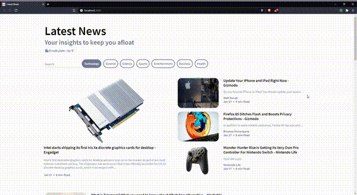

# News feed using React JS, News API, OpenWeather API

Live webiste url: https://entri2.web.app (News API doesn't allow hosted origin in free plans)

This project was bootstrapped with [Create React App](https://github.com/facebook/create-react-app).

## Steps to replicate the project in your local server

In the project directory, you can run:

### `npm install`

Install all necessary dependencies that are used in this project.

### `npm start`

Runs the app in the development mode.\
Open [http://localhost:3000](http://localhost:3000) to view it in the browser.
